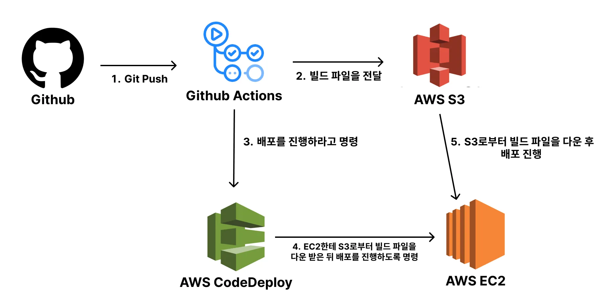

# CodeDepoly


# EC2 - Java 17, CodeDepoly Agent 설치

sudo apt update && /
sudo apt install openjdk-17-jdk -y

sudo apt update && \
sudo apt install -y ruby-full wget && \
cd /home/ubuntu && \
wget https://aws-codedeploy-ap-northeast-2.s3.ap-northeast-2.amazonaws.com/latest/install && \
chmod +x ./install && \
sudo ./install auto

# IAM
- EC2 - S3 읽기 권한
```json
{
  "Version": "2012-10-17",
  "Statement": [
    {
      "Action": [
        "s3:Get*",
        "s3:List*"
      ],
      "Effect": "Allow",
      "Resource": "*"
    }
  ]
}
```

- GITHUB - 사용자 s3FullAccess, CodeDeployFullAccess -> 키 등록
- CodeDeploy - codeDeployRole

spring boot - workflow.yml, appspec.yml, start-server.sh
# CI/CD 순서 
- push - checkout - application.yml 추가 - 빌드및테스트 
- 파일이름 변경 및 파일압축 - aws 로그인 - s3에 압축파일 전송

- code deploy로 ec2에게 배포 명령

